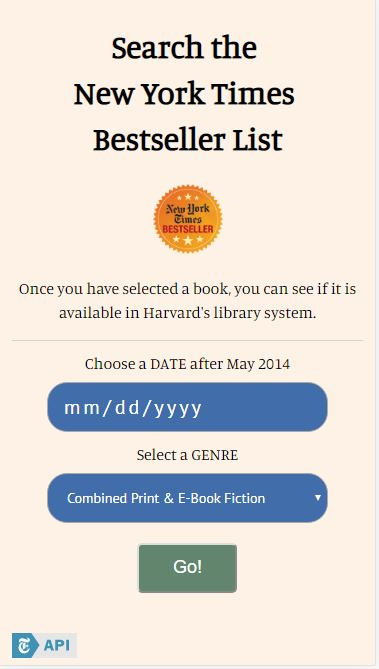
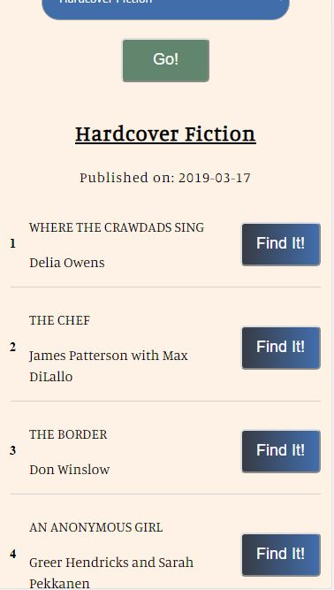
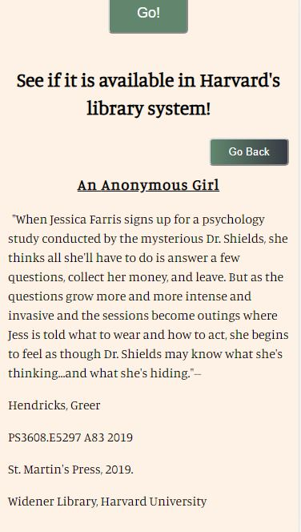

# Book Bestseller Finder

An app that allows the user to find lists of New York Times Bestsellers.  The app will then allow a user to see if the book is available in the Harvard library system.

## Live link:
https://hotdogmcgee.github.io/Book-Bestseller-Finder/

## User Flow

-- Users will see this screen, prompting them to select a date and genre:

-- Show a list of bestsellers:

-- After clicking a book, users can see if the book is available in the Harvard Library system.  They will also see some details about the selected book:

The original idea for the app was to use WorldCat's API to search for a specific library, but usage of the API is limited to institutions.  

Harvard's API works well enough, but the data structures are inconsistent. This had made the data a bit difficult to work with.

## Technologies Used

HTML, CSS, JavaScript, jQuery